# Customer Appointment Booking Flow - G1 Spa Management System

## 📋 Overview

This document provides a comprehensive analysis of the customer appointment booking flow in the G1 Spa Management System. The analysis covers the current implementation status, system architecture, and recommended improvements.

## 🔍 Current Implementation Status

The appointment booking system is **partially implemented** with a solid foundation but requires completion of core booking functionality.

### System Architecture

- **Backend**: Java Servlet + JSP (Jakarta EE)
- **Database**: MySQL
- **Frontend**: HTML5, CSS3, Bootstrap5, JavaScript
- **Pattern**: MVC (Model-View-Controller)
- **Authentication**: Session-based with role management

## 📁 File Structure

### Controllers

- `AppointmentController.java` - Handles appointment listing and viewing (read-only)
- `DashboardController.java` - Routes customer dashboard requests (includes TODO booking handlers)

### Models

- `Appointment.java` - Main appointment entity
- `BookingGroup.java` - Group booking support
- `AppointmentDetails.java` - Detailed appointment information
- `Customer.java` - Customer information

### Data Access Objects (DAOs)

- `AppointmentDAO.java` - Database operations for appointments
- `CustomerDAO.java` - Customer-related database operations

### JSP Views

Located in `/WEB-INF/view/customer/appointments/`:

- `booking.jsp` - Booking form (placeholder implementation)
- `upcoming.jsp` - Upcoming appointments view
- `history.jsp` - Appointment history view
- `list.jsp` - General appointment listing
- `details.jsp` - Appointment details view
- `reschedule.jsp` - Appointment rescheduling

## 🎯 Available Customer Features

Based on the customer sidebar navigation (`/WEB-INF/view/customer/shared/sidebar.jsp`):

### Appointment Management

1. **📅 Đặt Lịch Hẹn** (`/customer-dashboard/appointments/booking`)
2. **⏰ Lịch Hẹn Sắp Tới** (`/customer-dashboard/appointments/upcoming`)
3. **📜 Lịch Sử Lịch Hẹn** (`/customer-dashboard/appointments/history`)

### Additional Customer Features

- **Lịch Sử Liệu Pháp** - Treatment history
- **Phần Thưởng & Điểm** - Rewards and points system
- **Đề Xuất Dành Cho Bạn** - Personalized recommendations
- **Đánh Giá Của Tôi** - Customer reviews
- **Thanh Toán & Hóa Đơn** - Payment and billing history

## 🔄 Current Booking Flow

```mermaid
graph TD
    A[Customer Login] --> B[Customer Dashboard]
    B --> C[Click 'Đặt Lịch Hẹn']
    C --> D[Booking JSP Page - booking.jsp]
    D --> E[Placeholder UI with 'Chọn Dịch Vụ' Button]
    E --> F[❌ NO BACKEND IMPLEMENTATION]

    style F fill:#ffcccc
    style E fill:#fff3cd
```



### Current Booking Page Implementation

The `booking.jsp` file currently contains:

```html
<div class="text-center py-48">
  <iconify-icon
    icon="solar:calendar-add-outline"
    class="text-primary-600"
    style="font-size: 64px;"
  ></iconify-icon>
  <h6 class="text-neutral-600 mb-8 mt-3">Đặt Lịch Hẹn</h6>
  <p class="text-neutral-400 text-sm mb-24">
    Chọn dịch vụ và thời gian phù hợp để đặt lịch hẹn của bạn.
  </p>
  <div class="row justify-content-center">
    <div class="col-md-6">
      <button class="btn btn-primary btn-sm px-20 py-11 radius-8 w-100 mb-12">
        <iconify-icon
          icon="solar:spa-outline"
          class="icon text-lg me-8"
        ></iconify-icon>
        Chọn Dịch Vụ
      </button>
    </div>
  </div>
</div>
```

**Status**: Static placeholder with no form processing or backend integration.

## 🚧 Missing Implementation Details

### DashboardController TODO Items

```java
// Current implementation in DashboardController.java (line 415-418)
private void handleCustomerAppointments(HttpServletRequest request, HttpServletResponse response, String path)
        throws ServletException, IOException {
    // TODO: Implement customer appointment management
    request.getRequestDispatcher("/WEB-INF/view/customer/appointments/upcoming.jsp").forward(request, response);
}
```

### Missing Controllers

- **BookingController** - Dedicated controller for booking process
- **Service selection handlers**
- **Time slot management**
- **Payment processing integration**

### Missing Backend Logic

- Service catalog integration
- Available time slot calculation
- Therapist assignment logic
- Price calculation with promotions
- Booking confirmation workflow
- Email notification system

## 🗄️ Database Structure

### Core Tables (Based on Model Analysis)

#### appointments

- `appointment_id` (Primary Key)
- `customer_id` (Foreign Key)
- `booking_group_id` (Foreign Key, Optional)
- `therapist_user_id` (Foreign Key)
- `start_time`, `end_time`
- `total_original_price`, `total_discount_amount`
- `points_redeemed_value`, `total_final_price`
- `promotion_id`
- `status` (e.g., "PENDING_CONFIRMATION", "CONFIRMED")
- `payment_status` (e.g., "UNPAID", "PAID")
- `cancel_reason`
- `created_at`, `updated_at`

#### booking_groups

- `booking_group_id` (Primary Key)
- `represent_customer_id` (Foreign Key)
- `group_name`
- `expected_pax`
- `group_notes`
- `status`
- `created_at`, `updated_at`

#### appointment_details

- Links appointments to specific services
- Contains service-specific information

## 📋 Recommended Complete Booking Flow

```mermaid
graph TD
    A[Customer Login] --> B[Customer Dashboard]
    B --> C[Click 'Đặt Lịch Hẹn']
    C --> D[Service Selection Page]
    D --> E[Select Services & Add to Cart]
    E --> F[Date & Time Selection]
    F --> G[Therapist Selection/Assignment]
    G --> H[Customer Information Review]
    H --> I[Promotion & Points Application]
    I --> J[Payment Method Selection]
    J --> K[Booking Confirmation]
    K --> L[Email Notification]
    L --> M[Redirect to Upcoming Appointments]

    style D fill:#e8f5e8
    style E fill:#e8f5e8
    style F fill:#e8f5e8
    style G fill:#e8f5e8
    style H fill:#e8f5e8
    style I fill:#e8f5e8
    style J fill:#e8f5e8
    style K fill:#e8f5e8
    style L fill:#e8f5e8
    style M fill:#e8f5e8
```



## 🔧 Implementation Steps Required

### Phase 1: Core Booking Controller

1. **Create BookingController.java**

   ```java
   @WebServlet(name = "BookingController", urlPatterns = {"/booking", "/booking/*"})
   public class BookingController extends HttpServlet {
       // Handle booking workflow
   }
   ```

2. **Update DashboardController**
   - Replace TODO implementations
   - Add proper routing for customer appointment pages

### Phase 2: Service Selection

1. **Service Catalog Integration**

   - Display available services with prices
   - Multi-service selection capability
   - Service duration and description display

2. **Shopping Cart Functionality**
   - Add services to session-based cart
   - Calculate total prices
   - Apply promotional discounts

### Phase 3: Date & Time Management

1. **Calendar Interface**

   - Date picker integration
   - Available time slot calculation
   - Therapist availability checking

2. **Booking Constraints**
   - Service duration consideration
   - Buffer time between appointments
   - Holiday/closure date handling

### Phase 4: Booking Confirmation

1. **Customer Information Verification**

   - Review customer details
   - Special requests/notes collection
   - Contact information confirmation

2. **Payment Processing**
   - Multiple payment method support
   - Points/rewards redemption
   - Invoice generation

### Phase 5: Post-Booking Actions

1. **Confirmation System**

   - Database record creation
   - Booking reference generation
   - Status tracking initialization

2. **Notification System**
   - Email confirmation to customer
   - SMS notifications (if implemented)
   - Calendar event generation

## 🚀 Quick Start Implementation

### Step 1: Create Basic BookingController

```java
@WebServlet(name = "BookingController", urlPatterns = {"/booking"})
public class BookingController extends HttpServlet {

    @Override
    protected void doGet(HttpServletRequest request, HttpServletResponse response)
            throws ServletException, IOException {

        HttpSession session = request.getSession();
        Customer customer = (Customer) session.getAttribute("customer");

        if (customer == null) {
            response.sendRedirect(request.getContextPath() + "/login");
            return;
        }

        // Load services for selection
        // TODO: Implement service loading

        request.getRequestDispatcher("/WEB-INF/view/customer/appointments/booking.jsp")
               .forward(request, response);
    }

    @Override
    protected void doPost(HttpServletRequest request, HttpServletResponse response)
            throws ServletException, IOException {
        // Handle booking form submission
        // TODO: Implement booking logic
    }
}
```

### Step 2: Update web.xml

Add servlet mapping for booking controller:

```xml
<servlet>
    <servlet-name>BookingController</servlet-name>
    <servlet-class>controller.BookingController</servlet-class>
</servlet>

<servlet-mapping>
    <servlet-name>BookingController</servlet-name>
    <url-pattern>/booking</url-pattern>
</servlet-mapping>
```

### Step 3: Enhance booking.jsp

Replace placeholder content with actual booking form:

```html
<form action="${pageContext.request.contextPath}/booking" method="post">
  <!-- Service selection -->
  <!-- Date/time selection -->
  <!-- Customer notes -->
  <!-- Submit button -->
</form>
```

## 🔐 Security Considerations

### Authorization

- Customer authentication required
- Session validation on all booking endpoints
- CSRF protection for form submissions

### Data Validation

- Input sanitization for all form fields
- Date/time validation
- Service availability verification
- Payment amount verification

## 📊 Current System Capabilities

### ✅ Already Implemented

- Customer authentication system
- Role-based access control
- Database models and DAOs
- UI framework and styling
- Appointment viewing/listing
- Customer dashboard navigation

### ❌ Not Yet Implemented

- Actual booking form processing
- Service selection interface
- Time slot management
- Payment processing
- Email notifications
- Booking confirmation workflow

## 🎯 Conclusion

The G1 Spa Management System has a solid foundation for appointment booking with proper MVC architecture, database models, and UI framework. However, the core booking functionality requires implementation to provide a complete customer booking experience.

The recommended approach is to implement the booking system in phases, starting with basic service selection and progressing through the complete booking workflow as outlined in this document.

---

**Document Version**: 1.0  
**Last Updated**: Current Analysis  
**Author**: System Analysis  
**Status**: Implementation Required
